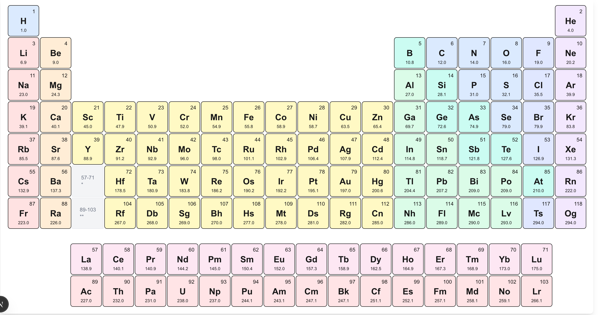
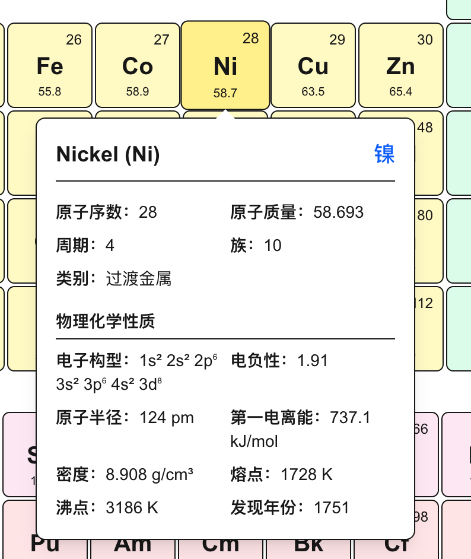

# 一个简单的元素周期表网页

## 效果
 1. 整体效果
   
 2. 细节展示
   

## Getting Started

1. 在控制台运行：
```bash
npm run dev
```

1. 在浏览器输入 [http://localhost:3000](http://localhost:3000) 

You can start editing the page by modifying `app/page.tsx`. The page auto-updates as you edit the file.

This project uses [`next/font`](https://nextjs.org/docs/app/building-your-application/optimizing/fonts) to automatically optimize and load [Geist](https://vercel.com/font), a new font family for Vercel.


